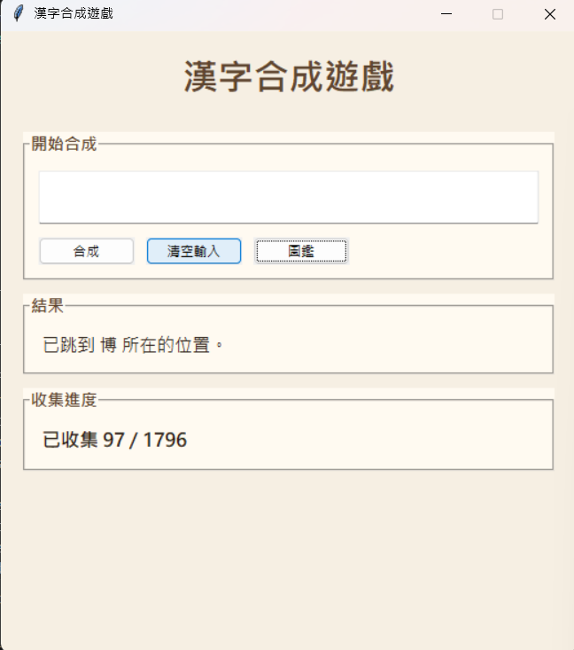
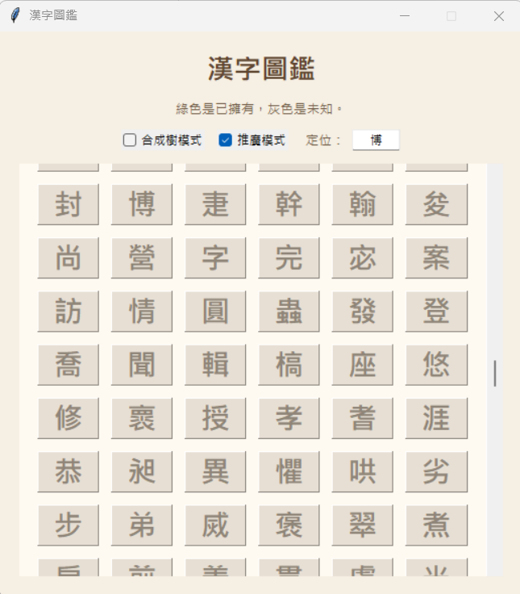
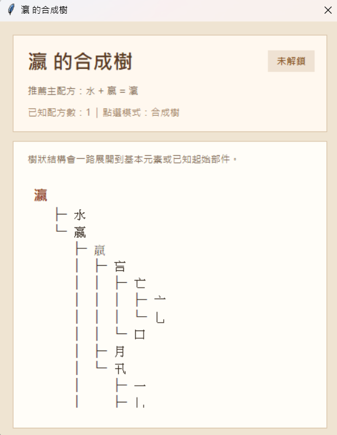
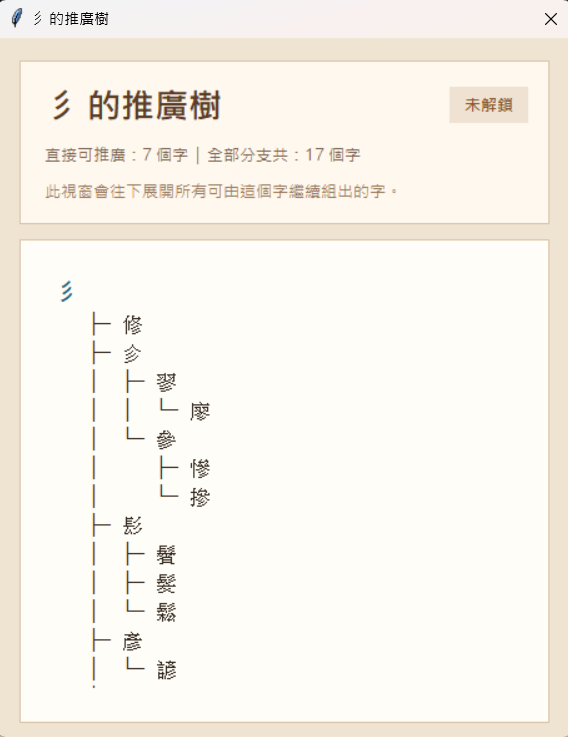

# 漢字合成遊戲

這是一個用 Python `tkinter` 製作的單機漢字合成遊戲。  
玩家可以從基本元素、輔助元素與部首元素出發，透過 2 到 10 個字的組合方式，逐步解鎖更多漢字，並在圖鑑裡查看分類、合成樹與推廣樹。

## 功能特色

- 支援 2 到 10 字合成
- 已解鎖漢字可重複拿來當材料
- 圖鑑依元素種類數分類顯示
- 圖鑑支援滾輪捲動
- 點擊圖鑑中的已解鎖字可自動加入輸入欄
- 開啟 `合成樹模式` 後，點字可查看完整合成樹
- 開啟 `推廣模式` 後，點字可查看該字能延伸出的推廣樹
- 圖鑑提供單字定位欄，可快速跳到指定漢字所在位置
- 合成樹與推廣樹視窗都會顯示摘要資訊與樹狀展開結果

## 畫面展示

### 主畫面



主畫面已簡化成專注操作的版面，保留最核心的互動區：

- 中間的輸入框可輸入 2 到 10 個已解鎖漢字
- `合成` 按鈕會嘗試配方
- `清空輸入` 可快速重設材料
- `圖鑑` 會開啟可捲動的漢字圖鑑
- 下方會顯示目前結果訊息與總收集進度
- 首頁不再放長串元素說明與範例字串，畫面更乾淨

### 圖鑑視窗



圖鑑視窗現在除了分類瀏覽，也加入了模式切換與定位功能：

- 綠色代表已擁有
- 灰色代表尚未解鎖
- 可用滑鼠滾輪上下瀏覽大量字卡
- 勾選 `合成樹模式` 後，點擊字卡會改成查看合成樹
- 勾選 `推廣模式` 後，點擊字卡會改成查看推廣樹
- 在 `定位` 欄輸入單一漢字後按 Enter，可直接跳到該字所在列
- 未勾選時，點擊已解鎖字可直接加入主畫面的輸入欄

### 合成樹視窗



合成樹視窗會從目標字一路往下拆解，直到基本元素或已知起始部件為止。  
這個版本的視窗會顯示：

- 字的名稱
- 是否已解鎖
- 推薦主配方
- 已知配方數量

下方的樹狀區會完整展開材料來源，方便追蹤一個字是如何一步步合成出來的。

### 推廣樹視窗



推廣樹視窗與合成樹相反，它不是往回拆，而是往下展開：

- 這個字可以直接推廣出哪些字
- 所有分支總共能延伸出多少字
- 各分支之間的後續推廣鏈

這讓玩家除了「怎麼做出這個字」之外，也能反過來看「拿到這個字之後還能做什麼」。

## 檔案結構

- [game.py](/C:/Users/USER/Documents/kanji/game.py)：主程式
- `assets/screenshots/`：README 使用的介面截圖

## 執行方式

先確認電腦已安裝 Python 3。

### PowerShell

```powershell
cd C:\Users\USER\Documents\kanji
py game.py
```

如果你的電腦沒有 `py`，可以改用：

```powershell
cd C:\Users\USER\Documents\kanji
python game.py
```

如果兩個指令都不能用，代表還沒安裝 Python。

## 遊戲玩法

1. 在主畫面的輸入欄輸入 2 到 10 個已解鎖漢字。
2. 按下 `合成`。
3. 如果配方存在，就會解鎖新字。
4. 如果配方不存在，系統會顯示提示訊息。
5. 你可以反覆用新解鎖的字繼續組合更多漢字。

## 圖鑑功能

圖鑑裡目前包含幾種互動方式：

- 一般模式：點擊已解鎖字，會自動加入主畫面的輸入欄
- 合成樹模式：勾選後，點擊任一字會開啟該字的完整合成樹視窗
- 推廣模式：勾選後，點擊任一字會開啟該字的推廣樹視窗
- 定位欄：輸入單一漢字後按 Enter，可直接捲動到該字所在位置

圖鑑分類目前包含：

- 基本元素
- 輔助元素
- 部首元素
- 使用 1 個不同元素
- 基本元素 + 輔助元素
- 基本元素 + 基本元素
- 使用 2 個不同元素
- 使用 3 個不同元素
- 依此類推

## 合成樹說明

合成樹會從你點選的字一路往下展開，直到基本元素或已知起始部件為止。  
如果一個字有多條配方，系統會優先顯示較直接的一條主配方。

## 推廣樹說明

推廣樹會從你點選的字往下列出所有可延伸的結果字。  
這個模式適合用來找「某個字解鎖後，還可以一路做出哪些字」。

## 開發說明

這個專案目前是單檔案程式，主要邏輯集中在 `game.py`：

- 配方資料表
- 解鎖邏輯
- 圖鑑分類
- 合成樹展開
- `tkinter` 視窗 UI

如果之後要擴充，建議可以優先拆分成：

- 配方資料模組
- 圖鑑 / 合成樹 UI 模組
- 遊戲主流程模組

## 備註

- 本專案目前沒有存檔功能
- 關閉程式後，解鎖進度不會保留
- 部分字有多種合成方式，實際顯示會以目前配方表與合成樹選擇邏輯為準
